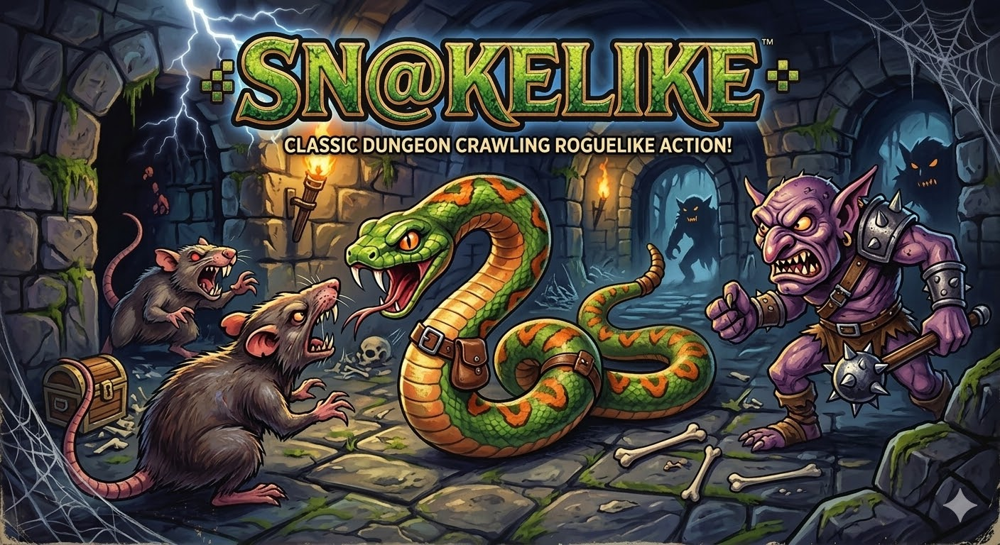

<picture>
     <source media="(prefers-color-scheme: dark)" srcset="snakelike-dark.svg">
     <source media="(prefers-color-scheme: light)" srcset="snakelike-light.svg">
     
   </picture>



Deep beneath the surface lies a dark dungeon full of rats, monsters, and forgotten treasure. A small hungry snake begins its journey there, slithering through tight stone halls and hunting rats to survive. Each rat it eats makes it grow longer and stronger, letting it face bigger enemies that guard the deeper rooms. The farther the snake travels, the more dangerous the dungeon becomes, with strange creatures and powerful bosses waiting below. What starts as a simple hunt for food slowly turns into a descent through the entire dungeon as the growing serpent fights, coils, and devours its way toward the darkest depths.

## Features

- **Procedural dungeons** BSP-generated maps that grow larger each level
- **Fog of war** raycasting FOV reveals the dungeon as you explore
- **Enemy AI** baddies patrol corridors; a 2×2 boss hunts you every 5th level
- **Power-ups** speed, shield, and phase pickups to turn the tide
- **Hazards** lava tiles and spike traps lurk in the darkness
- **Projectiles** fire your own tail segments to pierce enemies from range
- **Progression** clear all enemies to unlock the staircase to the next level
- **Retro audio** synthesized sound effects via the Web Audio API

## How to Play

| Key | Action |
|-----|--------|
| Arrow keys / WASD | Change direction |
| Space | Fire projectile (costs 2 tail segments; need length ≥ 3) |
| Any key | Start / Restart after Game Over |

### Basic Controls

Move through the dungeon, eat **rats** to grow, and kill every **baddie** (and the **boss**, on boss levels) to reveal the **staircase** to the next floor. Your snake's length is your health, each hit costs you a segment. If you're down to a single segment and take damage, it's game over.

### Combat Tips

- **Body kills** baddies that walk into your body die instantly. Lure them in!
- **Projectiles** press **Space** to fire a piercing shot from your head. It costs 2 tail segments but destroys every baddie in its path and chips 1 HP off the boss.
- **Shield** pick up the `+` power-up to absorb one free hit.
- **Phase** the `~` power-up lets you pass through walls for 3 seconds. Great for escapes.
- **Speed** the `*` power-up doubles your movement speed for 5 seconds.

## Bestiary

### Enemies

| Symbol | Name | Color | HP | Behavior |
|--------|------|-------|----|----------|
| `B` | Baddie | 🔴 | 1 | Patrols corridors, reverses on walls, shifts sideways. Contact with your head costs 1 segment. |
| `D` | Boss | 🟠 | 3 | 2×2 tile dragon that chases your head. Appears every 5th level. Flashes white when hit. |

- **Baddies** spawn at a rate of `4 + level` per floor (halved on boss levels).
- **Bosses** appear on levels 5, 10, 15, … and must be defeated alongside all baddies before the staircase opens.

### Collectibles

| Symbol | Name | Color | Effect |
|--------|------|-------|--------|
| `r` | Rat | 🟡 | Eat to grow by 1 segment. Rats spawn at a rate of `4 + level` per floor. |

### Power-ups

Three power-ups spawn on every floor:

| Symbol | Name | Color | Duration | Effect |
|--------|------|-------|----------|--------|
| `*` | Speed | 🔵 | 5 s | Doubles movement speed. |
| `+` | Shield | 🔵 | 30 s | Absorbs the next hit from any source. |
| `~` | Phase | 🟣 | 3 s | Pass through walls, teleports to the next open floor tile in your direction. |

Active power-ups and their remaining time are shown in the HUD.

### Hazards

| Symbol | Name | Color | Effect |
|--------|------|-------|--------|
| `~` | Lava | 🟠 | Instant death on contact. |
| `^` | Trap | 🟣 | Removes 1 segment on contact, then disappears. Fatal if you only have 1 segment. |

1–3 of each hazard type are scattered across every floor.

### Dungeon Features

| Symbol | Name | Color | Details |
|--------|------|-------|---------|
| `>` | Staircase | 🔵 | Appears in the room farthest from you once all enemies are defeated. Step on it to descend. |
| `#` | Wall | Grey | Impassable (unless you have the Phase power-up). |
| `.` | Floor | Dark grey | Safe to traverse. |

## Scoring

Your score is calculated using an additive formula:

```
Score = (Level × 100) + (Baddies Killed × 15) + (Max Snake Length × 5)
```

| Action | Points |
|--------|--------|
| Reach a new dungeon level | +100 per level |
| Kill a baddie | +15 per kill |
| Kill a boss | +100 bonus |
| Grow your snake | +5 per unit of max length |

Every action matters: kill baddies, eat rats to grow, and push deeper into the dungeon. There's an online leaderboard to share your glory!

## Getting Started

No build step required. Open `index.html` in a browser or serve it locally:

## License

See [LICENSE](LICENSE) for details.
